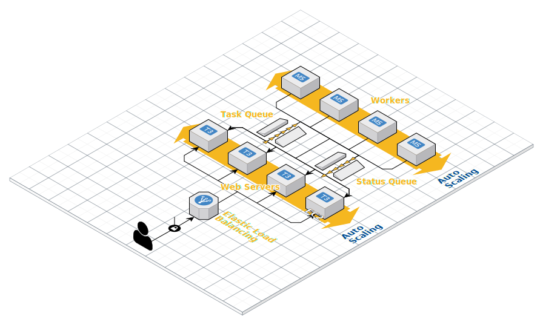

# Asynchronous Task Processing with AWS SQS

## Why async task processing

Task queues are used to manage background work that need to be executed outside the usual HTTP request-response cycle. Tasks are handled asynchronously either because they are not initiated by an HTTP request, or because they are long-running jobs that would dramatically reduce the performance of an HTTP response.

Some example of tasks that may necessitate the use of queues:
- Computationally expensive tasks e.g. machine learning model training/long-running inference tasks
- Spreading out a large amount of I/O over time e.g. database inserts, analytics collection

Generally, using message queues can help to decouple application components, so that they can run and fail independently. It also helps to make applications fault-tolerant and easier to scale.

## Messaging concepts

This repository demonstrates asynchronous task processing and the [Request-Reply pattern](https://www.enterpriseintegrationpatterns.com/patterns/messaging/RequestReply.html) via the use of [Point-to-point Channels](https://www.enterpriseintegrationpatterns.com/patterns/messaging/PointToPointChannel.html) in the form of [AWS SQS Standard Queues](https://docs.aws.amazon.com/AWSSimpleQueueService/latest/SQSDeveloperGuide/standard-queues.html). When a GET request is made to the `/fibonacci` endpoint of the app server, a message is sent to the queue which uses [Timeout-based Delivery](https://www.cloudcomputingpatterns.org/timeout_based_delivery/). Each worker is a [Polling Consumer](https://www.enterpriseintegrationpatterns.com/patterns/messaging/PollingConsumer.html) that need to process each message within a visibility timeout period. Multiple workers act together as [Competing Consumers](https://www.enterpriseintegrationpatterns.com/patterns/messaging/CompetingConsumers.html) to process the messages in parallel. This application is also designed as an [Idempotent Receiver](https://www.enterpriseintegrationpatterns.com/patterns/messaging/IdempotentReceiver.html) which is able to safely receive duplicate messages.



## Getting started

### Get the setup up and running:

```bash
docker-compose up
```

You should observe 4 containers being spun up:
- 1 app container, which represents an API server
- 2 worker containers, which performs the heavy compute
- 1 LocalStack container, which is our AWS SQS stand-in

Wait for a bunch of error messages to pass while LocalStack sets up the two SQS standard queues:

1. `FibonacciTaskQueue`, which holds messages defining the task from the app to the workers
2. `FibonacciStatusQueue`, which holds replies from the workers to the app

### Creating work for the workers

Task a worker to compute a Fibonacci number by calling the API server:

`http://localhost:5000/fibonacci?value=8`

You should get a response that looks like this:

```json
{
    "value":8,
    "callbackUrl":"http://localhost:5000/fibonacci/status/28d01842-8abe-8309-2194-d333d69cfc48"
}
```

Quickly visit the callback URL to verify the state of the pending calculation:

```json
{
    "status":"PENDING"
}
```

Wait long enough (~10s) and verify that the task has been completed:

```json
{
    "status":"COMPLETED",
    "value":13
}
```
which is the correct result since the 8th Fibonacci number is 13.

### Sending an invalid message

Send an invalid message by calling the API with an invalid _value_ parameter:

`http://localhost:5000/fibonacci?value=-1`

You should see the status update to failed:

```json
{
    "status":"FAILED",
    "error":"{\"message\":\"Invalid request in message.Body:-1\"}"
}
```

## Tweaking the infrastructure

LocalStack resource creation is defined in [docker-entrypoint-initaws.d](./docker-entrypoint-initaws.d/01-create-queues.sh).

## Before deploying to production

1. Design the tasks and the application to be _idempotent_, as standard queues cannot guarantee exactly-once delivery. If idempotency cannot be achieved, use a [FIFO queue](https://docs.aws.amazon.com/AWSSimpleQueueService/latest/SQSDeveloperGuide/FIFO-queues.html) instead, which provides deduplication, message ordering and exactly-once processing. The tradeoff is scalability and throughput.

2. Fine-tune the queue configuration to reflect the type of work that message consumers perform. For example, `VisibilityTimeout` limits the duration that a worker can process a message, before it is made visible to other consumers to be re-processed again. Configuring `ReceiveMessageWaitTimeSeconds` to the maximum of 20 seconds allows a comfortable duration for long-polling and reduces the number of requests made. Set an ample `MessageRetentionPeriod` so that downtime can be rectified without loss of state.

3. Set up a `RedrivePolicy` on a queue to limit the number of times a message can be received & processed, and automatically redirect messages that can't be processed successfully to a [Dead Letter Channel](https://www.enterpriseintegrationpatterns.com/patterns/messaging/DeadLetterChannel.html) where they can be investigated later. Alerts can be configured on the dead letter queues to warn if there are a large number of unprocessable messages.

## Useful guides

- [Dead Letter Queues](https://docs.aws.amazon.com/AWSSimpleQueueService/latest/SQSDeveloperGuide/sqs-dead-letter-queues.html)
- [Short and Long Polling](https://docs.aws.amazon.com/AWSSimpleQueueService/latest/SQSDeveloperGuide/sqs-short-and-long-polling.html#sqs-long-polling)
- [Recommendations for standard and FIFO queues](https://docs.aws.amazon.com/AWSSimpleQueueService/latest/SQSDeveloperGuide/sqs-standard-fifo-queue-best-practices.html)
- [Additional recommendations for FIFO queues](https://docs.aws.amazon.com/AWSSimpleQueueService/latest/SQSDeveloperGuide/sqs-additional-fifo-queue-recommendations.html)
- [Reducing costs](https://docs.aws.amazon.com/AWSSimpleQueueService/latest/SQSDeveloperGuide/reducing-costs.html)

## Further reading

- [Enterprise Integration Patterns](https://www.enterpriseintegrationpatterns.com/patterns/messaging/)